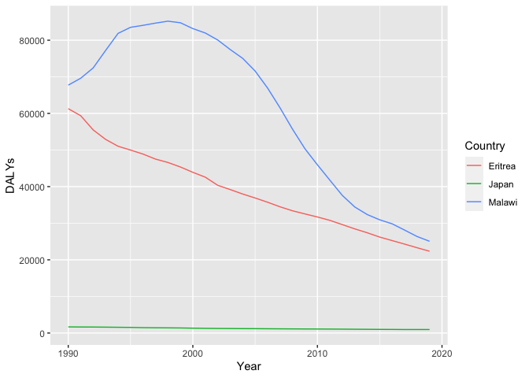

Global Disease Burden Analysis
================
REPLACE WITH THE AUTHOR NAMES

# Introduction

This document compares the Disability-Adjusted Life Year (DALY) diseases
burden for three countries: COUNTRY 1, COUNTRY 2, and COUNTRY 3. We
compare the burden due to communicable, maternal, neonatal, and
nutritional diseases (CMNN), non-communicable diseases (NCDs), and
overall disease burden for these countries.

The source data is from the Institute for Health Metrics and Evaluation
(IHME) Global Burden of Disease (GBD) study.

# Communicable, Maternal, Neonatal, and Nutritional Disease Burden (CMNN)

## Table of Estimates for CMNN Burden Over Time

| Code | Year |  Eritrea |     Japan |   Malawi |
|:-----|-----:|---------:|----------:|---------:|
| ERI  | 1990 | 61302.72 |        NA |       NA |
| ERI  | 1991 | 59371.26 |        NA |       NA |
| ERI  | 1992 | 55496.94 |        NA |       NA |
| ERI  | 1993 | 52903.11 |        NA |       NA |
| ERI  | 1994 | 51030.43 |        NA |       NA |
| ERI  | 1995 | 49990.97 |        NA |       NA |
| ERI  | 1996 | 48895.05 |        NA |       NA |
| ERI  | 1997 | 47528.56 |        NA |       NA |
| ERI  | 1998 | 46600.88 |        NA |       NA |
| ERI  | 1999 | 45369.34 |        NA |       NA |
| ERI  | 2000 | 43912.39 |        NA |       NA |
| ERI  | 2001 | 42581.60 |        NA |       NA |
| ERI  | 2002 | 40358.96 |        NA |       NA |
| ERI  | 2003 | 39198.20 |        NA |       NA |
| ERI  | 2004 | 37980.64 |        NA |       NA |
| ERI  | 2005 | 36897.48 |        NA |       NA |
| ERI  | 2006 | 35735.55 |        NA |       NA |
| ERI  | 2007 | 34487.31 |        NA |       NA |
| ERI  | 2008 | 33396.32 |        NA |       NA |
| ERI  | 2009 | 32540.19 |        NA |       NA |
| ERI  | 2010 | 31706.69 |        NA |       NA |
| ERI  | 2011 | 30785.05 |        NA |       NA |
| ERI  | 2012 | 29620.84 |        NA |       NA |
| ERI  | 2013 | 28454.99 |        NA |       NA |
| ERI  | 2014 | 27395.08 |        NA |       NA |
| ERI  | 2015 | 26215.07 |        NA |       NA |
| ERI  | 2016 | 25253.29 |        NA |       NA |
| ERI  | 2017 | 24293.63 |        NA |       NA |
| ERI  | 2018 | 23302.98 |        NA |       NA |
| ERI  | 2019 | 22347.26 |        NA |       NA |
| JPN  | 1990 |       NA | 1675.7707 |       NA |
| JPN  | 1991 |       NA | 1646.4943 |       NA |
| JPN  | 1992 |       NA | 1634.0107 |       NA |
| JPN  | 1993 |       NA | 1606.5737 |       NA |
| JPN  | 1994 |       NA | 1568.7557 |       NA |
| JPN  | 1995 |       NA | 1535.9674 |       NA |
| JPN  | 1996 |       NA | 1468.5303 |       NA |
| JPN  | 1997 |       NA | 1430.5855 |       NA |
| JPN  | 1998 |       NA | 1411.4048 |       NA |
| JPN  | 1999 |       NA | 1383.6155 |       NA |
| JPN  | 2000 |       NA | 1327.5424 |       NA |
| JPN  | 2001 |       NA | 1279.7103 |       NA |
| JPN  | 2002 |       NA | 1248.6345 |       NA |
| JPN  | 2003 |       NA | 1230.3399 |       NA |
| JPN  | 2004 |       NA | 1203.2242 |       NA |
| JPN  | 2005 |       NA | 1194.5089 |       NA |
| JPN  | 2006 |       NA | 1168.3218 |       NA |
| JPN  | 2007 |       NA | 1146.8287 |       NA |
| JPN  | 2008 |       NA | 1129.0598 |       NA |
| JPN  | 2009 |       NA | 1106.1977 |       NA |
| JPN  | 2010 |       NA | 1095.1670 |       NA |
| JPN  | 2011 |       NA | 1079.3234 |       NA |
| JPN  | 2012 |       NA | 1058.8803 |       NA |
| JPN  | 2013 |       NA | 1035.2016 |       NA |
| JPN  | 2014 |       NA | 1012.9629 |       NA |
| JPN  | 2015 |       NA |  993.2177 |       NA |
| JPN  | 2016 |       NA |  980.8555 |       NA |
| JPN  | 2017 |       NA |  958.3149 |       NA |
| JPN  | 2018 |       NA |  958.4397 |       NA |
| JPN  | 2019 |       NA |  957.1415 |       NA |
| MWI  | 1990 |       NA |        NA | 67720.68 |
| MWI  | 1991 |       NA |        NA | 69611.68 |
| MWI  | 1992 |       NA |        NA | 72425.84 |
| MWI  | 1993 |       NA |        NA | 77205.15 |
| MWI  | 1994 |       NA |        NA | 81870.48 |
| MWI  | 1995 |       NA |        NA | 83523.82 |
| MWI  | 1996 |       NA |        NA | 84066.40 |
| MWI  | 1997 |       NA |        NA | 84671.35 |
| MWI  | 1998 |       NA |        NA | 85203.76 |
| MWI  | 1999 |       NA |        NA | 84775.65 |
| MWI  | 2000 |       NA |        NA | 83179.92 |
| MWI  | 2001 |       NA |        NA | 81972.65 |
| MWI  | 2002 |       NA |        NA | 80059.14 |
| MWI  | 2003 |       NA |        NA | 77454.71 |
| MWI  | 2004 |       NA |        NA | 75049.23 |
| MWI  | 2005 |       NA |        NA | 71586.95 |
| MWI  | 2006 |       NA |        NA | 66929.50 |
| MWI  | 2007 |       NA |        NA | 61515.38 |
| MWI  | 2008 |       NA |        NA | 55699.27 |
| MWI  | 2009 |       NA |        NA | 50335.60 |
| MWI  | 2010 |       NA |        NA | 45957.25 |
| MWI  | 2011 |       NA |        NA | 41755.34 |
| MWI  | 2012 |       NA |        NA | 37589.36 |
| MWI  | 2013 |       NA |        NA | 34434.73 |
| MWI  | 2014 |       NA |        NA | 32365.33 |
| MWI  | 2015 |       NA |        NA | 30933.41 |
| MWI  | 2016 |       NA |        NA | 29834.47 |
| MWI  | 2017 |       NA |        NA | 28119.98 |
| MWI  | 2018 |       NA |        NA | 26372.76 |
| MWI  | 2019 |       NA |        NA | 25068.66 |

## Plot Showing Trends in CMNN Burden Over Time

<!-- -->

## Summary of CMNN Burden Findings

Provide a brief analysis based on the data presented in the table and
chart. Highlight any significant findings or patterns. About 3
sentences.

At first glance, the DALYs for the three countries (Eritrea, Malawi and
Japan) appear markedly different. Malawi seems to have the most DALYs in
terms of count across from 1990 to 2020, when compared to Eritrea and
Japan. Japan seems to have much lower DALYs with little variation from
1990 to 2020. \`\`\`

# Non-Communicable Disease Burden (NCD)

## Table of Estimates for NCD Burden Over Time

| Code | Year |  Eritrea |     Japan |   Malawi |
|:-----|-----:|---------:|----------:|---------:|
| ERI  | 1990 | 61302.72 |        NA |       NA |
| ERI  | 1991 | 59371.26 |        NA |       NA |
| ERI  | 1992 | 55496.94 |        NA |       NA |
| ERI  | 1993 | 52903.11 |        NA |       NA |
| ERI  | 1994 | 51030.43 |        NA |       NA |
| ERI  | 1995 | 49990.97 |        NA |       NA |
| ERI  | 1996 | 48895.05 |        NA |       NA |
| ERI  | 1997 | 47528.56 |        NA |       NA |
| ERI  | 1998 | 46600.88 |        NA |       NA |
| ERI  | 1999 | 45369.34 |        NA |       NA |
| ERI  | 2000 | 43912.39 |        NA |       NA |
| ERI  | 2001 | 42581.60 |        NA |       NA |
| ERI  | 2002 | 40358.96 |        NA |       NA |
| ERI  | 2003 | 39198.20 |        NA |       NA |
| ERI  | 2004 | 37980.64 |        NA |       NA |
| ERI  | 2005 | 36897.48 |        NA |       NA |
| ERI  | 2006 | 35735.55 |        NA |       NA |
| ERI  | 2007 | 34487.31 |        NA |       NA |
| ERI  | 2008 | 33396.32 |        NA |       NA |
| ERI  | 2009 | 32540.19 |        NA |       NA |
| ERI  | 2010 | 31706.69 |        NA |       NA |
| ERI  | 2011 | 30785.05 |        NA |       NA |
| ERI  | 2012 | 29620.84 |        NA |       NA |
| ERI  | 2013 | 28454.99 |        NA |       NA |
| ERI  | 2014 | 27395.08 |        NA |       NA |
| ERI  | 2015 | 26215.07 |        NA |       NA |
| ERI  | 2016 | 25253.29 |        NA |       NA |
| ERI  | 2017 | 24293.63 |        NA |       NA |
| ERI  | 2018 | 23302.98 |        NA |       NA |
| ERI  | 2019 | 22347.26 |        NA |       NA |
| JPN  | 1990 |       NA | 1675.7707 |       NA |
| JPN  | 1991 |       NA | 1646.4943 |       NA |
| JPN  | 1992 |       NA | 1634.0107 |       NA |
| JPN  | 1993 |       NA | 1606.5737 |       NA |
| JPN  | 1994 |       NA | 1568.7557 |       NA |
| JPN  | 1995 |       NA | 1535.9674 |       NA |
| JPN  | 1996 |       NA | 1468.5303 |       NA |
| JPN  | 1997 |       NA | 1430.5855 |       NA |
| JPN  | 1998 |       NA | 1411.4048 |       NA |
| JPN  | 1999 |       NA | 1383.6155 |       NA |
| JPN  | 2000 |       NA | 1327.5424 |       NA |
| JPN  | 2001 |       NA | 1279.7103 |       NA |
| JPN  | 2002 |       NA | 1248.6345 |       NA |
| JPN  | 2003 |       NA | 1230.3399 |       NA |
| JPN  | 2004 |       NA | 1203.2242 |       NA |
| JPN  | 2005 |       NA | 1194.5089 |       NA |
| JPN  | 2006 |       NA | 1168.3218 |       NA |
| JPN  | 2007 |       NA | 1146.8287 |       NA |
| JPN  | 2008 |       NA | 1129.0598 |       NA |
| JPN  | 2009 |       NA | 1106.1977 |       NA |
| JPN  | 2010 |       NA | 1095.1670 |       NA |
| JPN  | 2011 |       NA | 1079.3234 |       NA |
| JPN  | 2012 |       NA | 1058.8803 |       NA |
| JPN  | 2013 |       NA | 1035.2016 |       NA |
| JPN  | 2014 |       NA | 1012.9629 |       NA |
| JPN  | 2015 |       NA |  993.2177 |       NA |
| JPN  | 2016 |       NA |  980.8555 |       NA |
| JPN  | 2017 |       NA |  958.3149 |       NA |
| JPN  | 2018 |       NA |  958.4397 |       NA |
| JPN  | 2019 |       NA |  957.1415 |       NA |
| MWI  | 1990 |       NA |        NA | 67720.68 |
| MWI  | 1991 |       NA |        NA | 69611.68 |
| MWI  | 1992 |       NA |        NA | 72425.84 |
| MWI  | 1993 |       NA |        NA | 77205.15 |
| MWI  | 1994 |       NA |        NA | 81870.48 |
| MWI  | 1995 |       NA |        NA | 83523.82 |
| MWI  | 1996 |       NA |        NA | 84066.40 |
| MWI  | 1997 |       NA |        NA | 84671.35 |
| MWI  | 1998 |       NA |        NA | 85203.76 |
| MWI  | 1999 |       NA |        NA | 84775.65 |
| MWI  | 2000 |       NA |        NA | 83179.92 |
| MWI  | 2001 |       NA |        NA | 81972.65 |
| MWI  | 2002 |       NA |        NA | 80059.14 |
| MWI  | 2003 |       NA |        NA | 77454.71 |
| MWI  | 2004 |       NA |        NA | 75049.23 |
| MWI  | 2005 |       NA |        NA | 71586.95 |
| MWI  | 2006 |       NA |        NA | 66929.50 |
| MWI  | 2007 |       NA |        NA | 61515.38 |
| MWI  | 2008 |       NA |        NA | 55699.27 |
| MWI  | 2009 |       NA |        NA | 50335.60 |
| MWI  | 2010 |       NA |        NA | 45957.25 |
| MWI  | 2011 |       NA |        NA | 41755.34 |
| MWI  | 2012 |       NA |        NA | 37589.36 |
| MWI  | 2013 |       NA |        NA | 34434.73 |
| MWI  | 2014 |       NA |        NA | 32365.33 |
| MWI  | 2015 |       NA |        NA | 30933.41 |
| MWI  | 2016 |       NA |        NA | 29834.47 |
| MWI  | 2017 |       NA |        NA | 28119.98 |
| MWI  | 2018 |       NA |        NA | 26372.76 |
| MWI  | 2019 |       NA |        NA | 25068.66 |

## Plot Showing Trends in NCD Burden Over Time

<!-- -->

## Summary of NCD Burden Findings

Provide a brief analysis based on the data presented in the table and
chart. Highlight any significant findings or patterns. About 3
sentences. Malawi’s variation in non-communicable diseases seems to
spike upwards 1995 to 1998, then drop drastically downwards afterwards.
Comparatively, Eritrea has a steady decline of DALYs from 1990 to 2020,
while Japan’s seems to remain stable year-to-year.

Malawi’s variation in non-communicable diseases seems to spike upwards
1995 to 1998, then drop drastically downwards afterwards. Comparatively,
Eritrea has a steady decline of DALYs from 1990 to 2020, while Japan’s
seems to remain stable year-to-year.
